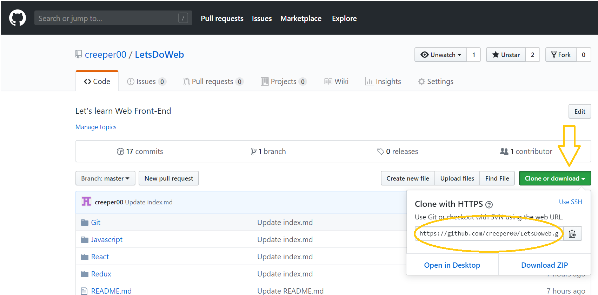

# Git Command   
git의 **기본적인 명령어** 들에 대해 알아봅시다!!!    
git 명령어들은 기본적으로 **git bash** 나 **cmd** 창에서 실행됩니다.   

## branch
먼저 가장 중요한 기능 중 하나인 **branch** 에 대해 알아봅시다.   
**branch** 는 여러 사람들이 함께 프로젝트를 할 때 큰 도움이 되는 기능입니다. branch는 하나의 소스코드 뿌리(master branch)에서 갈라져 나온 가지(branch)라고 생각할 수 있습니다. 여러 사람이 같이 한 소스코드를 공유하면 각자의 역할에 따라 수정하고 고치는 부분이 다를 수 있죠. 이때 branch를 만들면 원본 코드에 영향을 미치지 않고 독자적인 공간에서 수정 작업을 할 수 있습니다. 수정을 마치고, 리뷰까지 완료한 뒤, 원본(master)과 merge하는 것으로 하나로 합쳐집니다.   
이해하기 쉽도록 간단한 예시를 들어보도록 하죠. 자소서를 쓰는 상황을 생각해봅시다. 일단 한 번 처음부터 끝까지 글을 썼습니다. 당연히 탈고 작업을 진행해야겠죠? 이때 혹시 원본(master)의 내용을 해칠 수 있으니, 자소서의 복사본을 만들어 탈고를 하였습니다. 이때 원본을 냅두고 만든 복사본이 branch라고 할 수 있습니다. 이 복사본(branch)를 수정한 뒤, 마음에 들면 이것이 새로운 원본이 되겠죠? 이런 과정이 branch를 사용하는 과정입니다.   
`git branch <branch name>`     
위 명령어를 통해 branch가 생성됩니다. branch는 그 시점에서의 master와 같은 내용을 담고 있습니다.     
`git branch`       
위 명령어를 통해 현재 존재하는 branch의 목록을 볼 수 있습니다. * 가 붙어있는 것이 현재 branch 입니다.     
`git checkout <branch name>`       
branch를 전환하는 명령어입니다. 여러 branch가 있을 때 원하는 branch로 전환할 수 있습니다.   
`git merge <branch name>`     
현재 branch에 다른 branch를 merge하는 명령어다.   

`git branch -d <branch name>`      
특정 branch를 삭제하는 명령어다.

## git clone
`git clone <저장소 url>`     
위의 'git clone' 명령어를 통해 github의 원격 저장소의 소스 코드를 받아올 수 있습니다. clone이라는 말처럼 저장소를 복제하여 가져옵니다.   
   

## git pull
`git pull <저장소 url>`   
메인 저장소에 있는 내용을 현재 나의 저장소(또는 branch)로 업데이트 합니다. 동료들이 변경사항을 추가한 경우 현재 나의 저장소의 내용과 모두가 공유하는 메인 저장소의 내용이 달라집니다. 이때 pull을 통해 달라진 내용을 받아옵니다. 이미 clone된 저장소가 있다면 저장소 url을 일일이 타이핑할 필요없이, 해당 레포지토리 내에서 `git pull`하는 것으로 받아올 수 있습니다.

## git add
`git add <file>`   
단순히 저장소에 파일을 넣는다고 변경사항이 적용되지 않습니다. `git add`를 해주어야 새로 추가된 파일이 인식 됩니다. 기존 파일의 내용을 바꾸었을 때도, `git add`로 변경사항을 인식합니다.

## git commit 
 `git commit -m "message"` 이렇게 실행해야합니다. commit에서 message를 필수로 요구합니다.
 
 ## git push
 `git push <저장소 url>`
 변경사항을 최종적으로 저장소에 적용시킵니다.
 
 ----
 기본적인 git의 명령어들을 알아보았습니다. 초기 단계에서는 이정도만으로도 충분할 것입니다.   
 혹시라도 부족한 부분은 구글링이나 참조를 통해 알아보시면 될 것 같습니다. 
   
